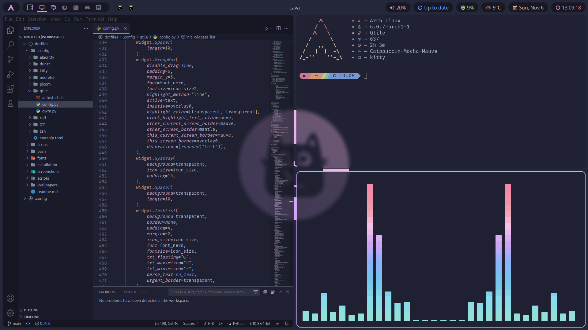

# Screenshot

# Table of contents
- [List of software](#list-of-software)
    - [Qtile](#qtile)
    - [Catppuccin](#catppuccin)
    - [Wallpapers](#wallpapers)
    - [Picom](#picom)
    - [Zsh](#zsh)
    - [Rofi](#rofi)
    - [Nerd Font](#nerd-font)
    - [Grub](#grub)
- [Installation on Fedora](installation/fedora.md)
- [Installation on Arch](installation/arch.md)

# List of software
- Window manager: [Qtile](#qtile)
- Colour scheme: [Catppuccin](#catppuccin)
- Wallpapers: [Catppuccin](#wallpapers)
- GTK theme: [Catppuccin](https://github.com/catppuccin/gtk)
- Cursor theme: [Volantes](https://www.gnome-look.org/p/1356095)
- Compositor: [Picom](#picom)
- Shell: [Zsh](#zsh)
- Terminal: [Kitty](https://sw.kovidgoyal.net/kitty/)
- Prompt: [Starship](https://starship.rs/)
- Launcher: [Rofi](#rofi)
- Fetch: [Neofetch](https://github.com/dylanaraps/neofetch)
- Notifications: [Dunst](https://dunst-project.org/)
- Nerd Font: [Fira Code](#nerd-font)
- Bootloader: [Grub](#grub)

## Catppuccin
Catppuccin is a community-driven pastel theme that aims to be the middle ground between low and high contrast themes. It consists of 4 soothing warm palettes with 26 eye-candy colors each, perfect for coding, designing, and much more!
- [Official repository](https://github.com/catppuccin/catppuccin)
- [Project's documentation](https://github.com/catppuccin/catppuccin/tree/dev/docs)

I use **Catppuccin Mocha** palette in my configurations.
## Qtile
#### Information:
- [Official website](http://www.qtile.org/)
- [Qtile documentation](http://docs.qtile.org/en/stable/)
- [Qtile extras documentation](https://qtile-extras.readthedocs.io/en/stable/index.html)
#### Dependencies:
- [Qtile extras](https://qtile-extras.readthedocs.io/en/stable/manual/install.html)
- [Psutil](https://pypi.org/project/psutil/)
- [Nerd font](#nerd-font)
- [Open Sans font](https://fonts.google.com/specimen/Open+Sans)

## Wallpapers
[Official repository](https://github.com/catppuccin/wallpapers). Wallpapers I use:
- Modified version (gimp file included) of [unicat](https://github.com/catppuccin/wallpapers/blob/main/minimalistic/black5_unicat.png) by [Pocco81](https://github.com/Pocco81)
- [Flatppuccin](https://github.com/catppuccin/wallpapers/blob/main/flatppuccin/flatppuccin_4k_macchiato.png) by [Adal Zanabria](https://github.com/AdalZanabria)

## Picom
There are a lot of Picom forks, but I decided to stick to the main one (made by [yshui](https://github.com/yshui)). However, the latest version is required. The easiest way to install it is by using the [AUR](https://aur.archlinux.org/).
- [Official repository](https://github.com/yshui/picom)
- [AUR package](https://aur.archlinux.org/packages/picom-git)

## Zsh
[Official website](https://www.zsh.org/). Plugins I use:
- [Autosuggestions](https://github.com/zsh-users/zsh-autosuggestions)
- [Syntax highlighting](https://github.com/zsh-users/zsh-syntax-highlighting)
- [Directory history](https://github.com/ohmyzsh/ohmyzsh/tree/master/plugins/dirhistory)
- [Sudo](https://github.com/ohmyzsh/ohmyzsh/tree/master/plugins/sudo)

## Rofi
I'm **not** an author of the Rofi config included in this repository. It's: [Catppuccin for Rofi - Siduck's Theme](https://github.com/catppuccin/rofi/tree/main/basic).

## Nerd Font
I use **Fira Code Nerd Font Mono**. You can download its latest release from: [Nerd Fonts website](https://www.nerdfonts.com/font-downloads).

**
Remember to install the mono variant of chosen Nerd Font. Icons are not centered in the regular version.
**

## Grub
**Not included in my repository**. I use: [Catppuccin for Grub](https://github.com/catppuccin/grub).

# [Installation on Fedora](installation/fedora.md)

# [Installation on Arch](installation/arch.md)